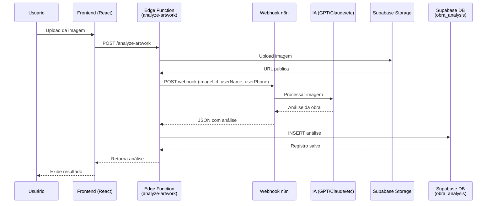

# API de Análise de Obras de Arte

## Visão Geral

O sistema de análise de obras de arte utiliza um webhook n8n integrado com IA para processar imagens enviadas pelos usuários e fornecer análises detalhadas sobre:

- Sugestão de título
- Descrição detalhada da imagem
- Classificação do estilo artístico
- Feedback construtivo para o artista

## Arquitetura



## Estrutura de Dados

### Resposta do Webhook n8n

O webhook n8n deve retornar um JSON com a seguinte estrutura:

```json
{
  "Sugestão de Titulo": "Título sugerido para a obra",
  "Descrição da Imagem detalhada": "Descrição completa e detalhada da obra...",
  "Classificação do estilo": "Estilo artístico identificado (ex: Impressionismo, Abstrato, etc.)",
  "Uma opinião construtiva visando a melhoria do artista": "Feedback construtivo para o artista..."
}
```

**Formatos aceitos:**

1. **Objeto direto:**
   ```json
   {
     "Sugestão de Titulo": "...",
     "Descrição da Imagem detalhada": "...",
     ...
   }
   ```

2. **Array com objeto:**
   ```json
   [
     {
       "Sugestão de Titulo": "...",
       "Descrição da Imagem detalhada": "...",
       ...
     }
   ]
   ```

3. **Objeto com propriedade `json`:**
   ```json
   {
     "json": {
       "Sugestão de Titulo": "...",
       "Descrição da Imagem detalhada": "...",
       ...
     }
   }
   ```

### Tabela `obra_analysis`

```sql
CREATE TABLE obra_analysis (
  id BIGSERIAL PRIMARY KEY,
  created_at TIMESTAMPTZ DEFAULT NOW(),
  user_id UUID REFERENCES auth.users(id),
  image_url TEXT,
  suggested_title TEXT,
  description TEXT,
  style_classification TEXT,
  constructive_feedback TEXT
);
```

## Mapeamento de Campos

A Edge Function implementa normalização robusta que remove acentos e é case-insensitive. Os campos são mapeados da seguinte forma:

| Campo no Banco | Nomes Aceitos na Resposta |
|----------------|---------------------------|
| `suggested_title` | "Sugestão de Titulo"<br/>"Sugestão de Título"<br/>"Sugestao de Titulo"<br/>"sugestão de titulo"<br/>"sugestao de titulo" |
| `description` | "Descrição da Imagem detalhada"<br/>"Descricao da Imagem detalhada"<br/>"descrição da imagem detalhada"<br/>"descricao da imagem detalhada"<br/>"Descrição"<br/>"Descricao" |
| `style_classification` | "Classificação do estilo"<br/>"Classificacao do estilo"<br/>"classificação do estilo"<br/>"classificacao do estilo"<br/>"Estilo" |
| `constructive_feedback` | "Uma opinião construtiva visando a melhoria do artista"<br/>"Uma opiniao construtiva visando a melhoria do artista"<br/>"uma opinião construtiva visando a melhoria do artista"<br/>"uma opiniao construtiva visando a melhoria do artista"<br/>"Opinião Construtiva"<br/>"Opiniao Construtiva"<br/>"Feedback" |

### Normalização de Chaves

A função `normalizeString()` na Edge Function realiza:

1. Converte para lowercase
2. Remove acentos usando Unicode normalization (NFD)
3. Remove espaços em branco extras (trim)

Exemplo:
```
"Sugestão de Título" → "sugestao de titulo"
"DESCRIÇÃO DA IMAGEM" → "descricao da imagem"
```

## Validação de Dados

A Edge Function valida:

1. **Pelo menos um campo preenchido:** Se todos os campos estiverem vazios, a função retorna erro.
2. **Imagem válida:** Se o título for "Imagem Inválida para Análise", a função deleta a imagem do storage e retorna erro.
3. **Autenticação:** Apenas usuários autenticados podem enviar imagens para análise.

## Logs de Debug

A Edge Function gera logs detalhados para facilitar debugging:

```
[analyze-artwork] ====== RESPOSTA BRUTA DO N8N ======
[analyze-artwork] Tipo: object
[analyze-artwork] É Array: false
[analyze-artwork] Resposta completa: { ... }

[analyze-artwork] ====== RAW DATA ======
[analyze-artwork] rawData: { ... }

[analyze-artwork] ====== RESULT DATA (após verificar .json) ======
[analyze-artwork] resultData: { ... }
[analyze-artwork] Chaves presentes: ["Sugestão de Titulo", "Descrição da Imagem detalhada", ...]

[analyze-artwork] ====== NORMALIZED RESULT DATA ======
[analyze-artwork] Mapeamento: "Sugestão de Titulo" -> "sugestao de titulo"
[analyze-artwork] normalizedResultData: { ... }

[analyze-artwork] ====== INSERT PAYLOAD ======
[analyze-artwork] Payload para inserção: { ... }

[analyze-artwork] ✅ Análise salva com sucesso!
```

## Tratamento de Erros

### Erro: "Todos os campos estão vazios"

**Causa:** A resposta do n8n não contém os campos esperados ou os nomes dos campos são diferentes.

**Solução:**
1. Verificar os logs da Edge Function no Supabase Dashboard
2. Comparar as chaves presentes na resposta com os nomes esperados
3. Se necessário, adicionar mais variações de nomes no mapeamento

### Erro: "Imagem inválida para análise"

**Causa:** A IA não conseguiu processar a imagem (formato inválido, corrupto, muito pequeno, etc.).

**Solução:**
1. Verificar se o arquivo é uma imagem válida
2. Tentar com outra imagem
3. Verificar o tamanho e formato da imagem

### Erro: "A URL do webhook não está configurada"

**Causa:** A configuração `n8n_webhook_url` não está definida na tabela `settings`.

**Solução:**
1. Acessar a página de configurações administrativas
2. Adicionar a URL do webhook n8n
3. Salvar e tentar novamente

## Configuração

### 1. Configurar Webhook n8n

No painel administrativo, vá em **Configurações** e adicione a URL do webhook:

```
https://seu-n8n-instance.com/webhook/analyze-artwork
```

### 2. Deploy da Edge Function

```bash
supabase functions deploy analyze-artwork
```

### 3. Configurar Variáveis de Ambiente

Certifique-se de que as seguintes variáveis estão configuradas no Supabase:

- `SUPABASE_URL`
- `SUPABASE_ANON_KEY`
- `SUPABASE_SERVICE_ROLE_KEY`

## Exemplos de Respostas

### Resposta Válida

```json
{
  "Sugestão de Titulo": "Reflexão Urbana ao Entardecer",
  "Descrição da Imagem detalhada": "A obra apresenta uma paisagem urbana capturada durante o crepúsculo, com tons quentes de laranja e rosa dominando o céu. A composição equilibrada destaca edifícios modernos refletidos em uma superfície aquática, criando uma simetria interessante. A profundidade de campo é bem utilizada, mantendo o foco nos elementos principais enquanto suaviza o fundo.",
  "Classificação do estilo": "Fotografia Contemporânea com elementos de Realismo Urbano. A captura demonstra influências da fotografia de paisagem urbana moderna, com atenção especial à qualidade da luz e composição geométrica.",
  "Uma opinião construtiva visando a melhoria do artista": "Sua captura demonstra excelente domínio da luz natural e timing. Para evoluir ainda mais:\n\n1. Experimente diferentes ângulos para criar composições mais dinâmicas\n2. Explore o uso de linhas diagonais para adicionar movimento\n3. Considere o uso de filtros para intensificar ou suavizar cores\n4. Trabalhe a pós-produção para realçar detalhes nas sombras\n\nContinue explorando o potencial narrativo das cenas urbanas!"
}
```

### Resposta de Imagem Inválida

```json
{
  "Sugestão de Titulo": "Imagem Inválida para Análise",
  "Descrição da Imagem detalhada": "Não foi possível processar a imagem enviada...",
  "Classificação do estilo": "N/A",
  "Uma opinião construtiva visando a melhoria do artista": "Por favor, envie uma imagem válida para análise."
}
```

## Troubleshooting

### Problema: Campos aparecem como `null` no banco de dados

**Diagnóstico:**

1. Verificar logs da Edge Function:
   ```
   Supabase Dashboard → Edge Functions → analyze-artwork → Logs
   ```

2. Procurar por:
   - `====== RESPOSTA BRUTA DO N8N ======`
   - `====== INSERT PAYLOAD ======`
   - Warnings: `⚠️ Campo 'xxx' está vazio`

3. Comparar as chaves na resposta com os nomes esperados

**Soluções possíveis:**

- Se as chaves tiverem nomes diferentes, adicionar variações no código
- Se a estrutura for aninhada, ajustar extração do `resultData`
- Verificar se o webhook n8n está retornando dados corretamente

### Problema: Erro "Auth session missing"

**Causa:** Usuário não está autenticado ou token expirou.

**Solução:**
- Fazer logout e login novamente
- Verificar se o token JWT está sendo enviado corretamente

### Problema: Upload muito lento

**Causa:** Imagem muito grande.

**Solução:**
- Redimensionar imagem antes do upload
- Usar formatos comprimidos (JPEG, WebP)
- Limitar tamanho máximo no frontend

## API Reference

### Endpoint: `POST /functions/v1/analyze-artwork`

**Headers:**
```
Authorization: Bearer {token}
Content-Type: image/jpeg (ou image/png, image/webp, etc.)
```

**Body:**
```
[Binary da imagem]
```

**Resposta de Sucesso (200):**
```json
{
  "id": 13,
  "created_at": "2026-01-12T23:55:29.01307+00:00",
  "user_id": "3dc1c8aa-16eb-40d0-b2c1-079c3c3730dc",
  "image_url": "analysis_images/3dc1c8aa-16eb-40d0-b2c1-079c3c3730dc/760aab60-d42c-4043-b049-10b5be67d7d8.jpeg",
  "suggested_title": "Título da Obra",
  "description": "Descrição detalhada...",
  "style_classification": "Estilo artístico",
  "constructive_feedback": "Feedback construtivo..."
}
```

**Resposta de Erro (500):**
```json
{
  "error": "Mensagem de erro descritiva"
}
```

## Manutenção

### Adicionar Novos Campos

1. Adicionar coluna na tabela `obra_analysis`:
   ```sql
   ALTER TABLE obra_analysis ADD COLUMN novo_campo TEXT;
   ```

2. Atualizar `insertPayload` na Edge Function:
   ```typescript
   novo_campo: getFieldValue(resultData, ["Nome do Campo", "Variação 1", "Variação 2"]),
   ```

3. Atualizar frontend para exibir novo campo

### Modificar Nomes de Campos Aceitos

Editar o array em `getFieldValue()` na Edge Function:

```typescript
suggested_title: getFieldValue(resultData, [
  "Sugestão de Titulo",
  "Novo Nome Aceito",  // ← Adicionar aqui
  "Outra Variação",
]),
```

---

**Última atualização:** 2026-01-13
